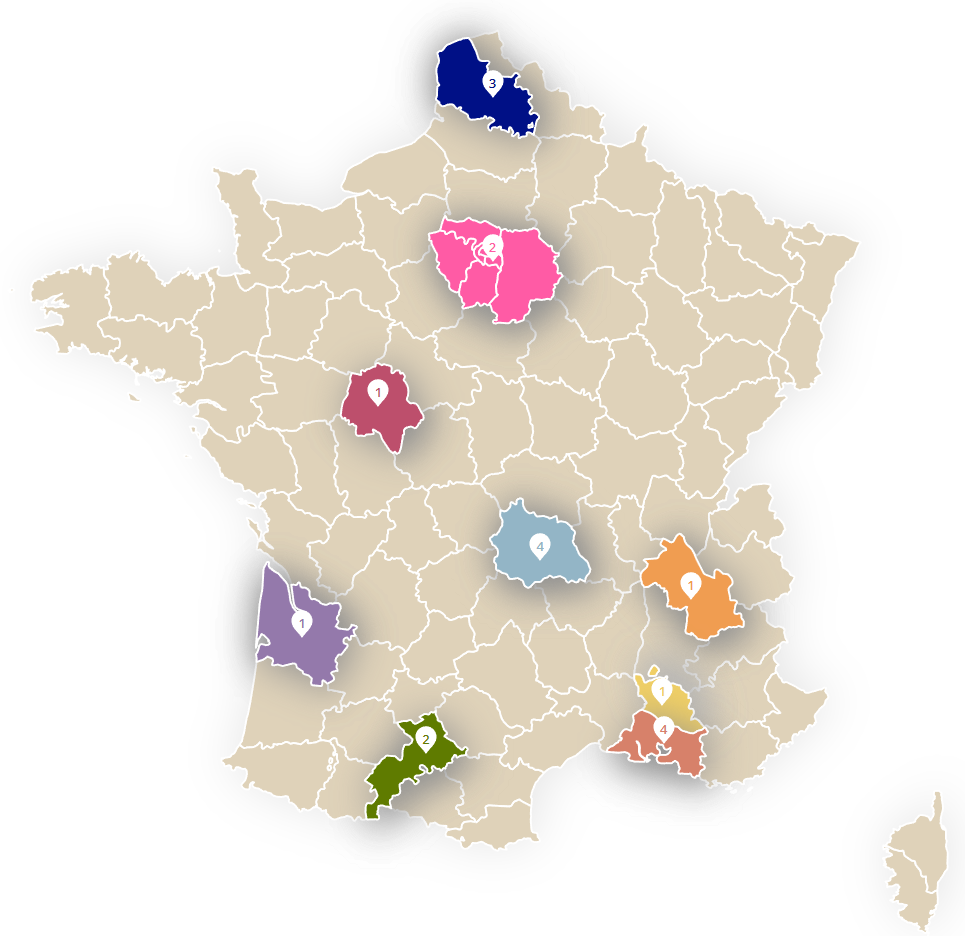

# 2023 CDA alternance spécialisation DEVOPS P3

Titre Professionnel  
Concepteur Développeur d'Applications 2023 - France  
Spécialisation DEVOPS

## Qui sommes nous

<figure>
    

        
    

    

        <figcaption><a href="https://trombi-p3.netlify.app" align="center">https://trombi-p3.netlify.app</a> (<a href="https://github.com/Sara-Dona">Sara</a>, <a href="https://github.com/Andrealpz">Andrea</a>, <a href="https://github.com/FlexCodeur">Mehdi</a>)</figcaption>
    

</figure>

## Technologies

&nbsp;&nbsp;

&nbsp;&nbsp;

&nbsp;&nbsp;

&nbsp;&nbsp;

&nbsp;&nbsp;

&nbsp;&nbsp;

&nbsp;&nbsp;

&nbsp;&nbsp;

&nbsp;&nbsp;

## Réalisations

| Briefs | Technologies | <a href="https://github.com/Havakii">Hava</a> | <a href="https://github.com/Kalsak15">Lucas</a> | <a href="https://github.com/rbufnoir">Rémi</a> | <a href="https://github.com/sebcriado">Sébastien</a> | <a href="https://github.com/PaulineCurt">Pauline</a> | <a href="https://github.com/Sara-Dona">Sara</a> | <a href="https://github.com/arnaudfl">Arnaud</a> | <a href="https://github.com/AurelienGEORGES">Aurélien</a> | <a href="https://github.com/Andrealpz">Andrea</a> | <a href="https://github.com/MikeZek">Michael</a> | <a href="https://github.com/mikaocko">Magali Kimberly</a> | <a href="https://github.com/FlexCodeur">Mehdi</a> | <a href="https://github.com/FlexCodeur">Nelli</a> | <a href="https://github.com/ColasCitron">Nicolas</a> | <a href="https://github.com/alanzarli">Alan</a> |
| :----: | :----: | :----: | :----: | :----: | :----: | :----: | :----: | :----: | :----: | :----: | :----: | :----: | :----: | :----: | :----: | :----: |
| [S'approprier le REAC](https://github.com/2023-cda-alt-devops-p3/reac) |  | <a href="https://github.com/2023-cda-alt-devops-p3/reac-hb">🔵</a> | <a href="https://github.com/2023-cda-alt-devops-p3/reac-lb">🟡</a> | <a href="https://github.com/2023-cda-alt-devops-p3/reac-rb">🟡</a> | <a href="https://github.com/2023-cda-alt-devops-p3/reac-sc">🔴</a> | <a href="https://github.com/2023-cda-alt-devops-p3/reac-pc">🔗</a> | <a href="https://github.com/2023-cda-alt-devops-p3/reac-sd">⚪</a> | <a href="https://github.com/2023-cda-alt-devops-p3/reac-af">⚪</a> | <a href="https://github.com/2023-cda-alt-devops-p3/reac-ag">⚪</a> | <a href="https://github.com/2023-cda-alt-devops-p3/reac-al">🔵</a> | <a href="https://github.com/2023-cda-alt-devops-p3/reac-mz">🟠</a> | <a href="https://github.com/2023-cda-alt-devops-p3/reac-mkm">🟠</a> | <a href="https://github.com/2023-cda-alt-devops-p3/reac-mr">🟡</a> | <a href="https://github.com/2023-cda-alt-devops-p3/reac-ntm">🔴</a> | <a href="https://github.com/2023-cda-alt-devops-p3/reac-nt">⚪</a> | <a href="https://github.com/2023-cda-alt-devops-p3/reac-az">🔴</a> |
| [Catalogue de diagrammes](https://github.com/2023-cda-alt-devops-p3/catalog) | &nbsp;&nbsp; | <a href="https://github.com/2023-cda-alt-devops-p3/catalog-hb">🔗</a> | <a href="https://github.com/2023-cda-alt-devops-p3/catalog-lb">🔗</a> | <a href="https://github.com/2023-cda-alt-devops-p3/catalog-rb">🔗</a> | <a href="https://github.com/2023-cda-alt-devops-p3/catalog-sc">🔗</a> | <a href="https://github.com/2023-cda-alt-devops-p3/catalog-pc">🔗</a> | <a href="https://github.com/2023-cda-alt-devops-p3/catalog-sd">🔗</a> | <a href="https://github.com/2023-cda-alt-devops-p3/catalog-af">🔗</a> | <a href="https://github.com/2023-cda-alt-devops-p3/catalog-ag">🔗</a> | <a href="https://github.com/2023-cda-alt-devops-p3/catalog-al">🔗</a> | <a href="https://github.com/2023-cda-alt-devops-p3/catalog-mz">🔗</a> | <a href="https://github.com/2023-cda-alt-devops-p3/catalog-mkm">🔗</a> | <a href="https://github.com/2023-cda-alt-devops-p3/catalog-mr">🔗</a> | <a href="https://github.com/2023-cda-alt-devops-p3/catalog-ntm">🔗</a> | <a href="https://github.com/2023-cda-alt-devops-p3/catalog-nt">🔗</a> | <a href="https://github.com/2023-cda-alt-devops-p3/catalog-az">🔗</a> |
| [On est là](https://github.com/2023-cda-alt-devops-p3/trombi) | &nbsp;&nbsp; | <a href="https://github.com/2023-cda-alt-devops-p3/trombi-hb">🔴</a> | <a href="https://github.com/2023-cda-alt-devops-p3/trombi-lb">🟡</a> | <a href="https://github.com/2023-cda-alt-devops-p3/trombi-rb">🔵</a> | <a href="https://github.com/2023-cda-alt-devops-p3/trombi-ag">🟠</a> | <a href="https://github.com/2023-cda-alt-devops-p3/trombi-pc">🟠</a> | <a href="https://github.com/2023-cda-alt-devops-p3/trombi-mr">🟤</a> | <a href="https://github.com/2023-cda-alt-devops-p3/trombi-am">🟢</a> | <a href="https://github.com/2023-cda-alt-devops-p3/trombi-ag">🟠</a> | <a href="https://github.com/2023-cda-alt-devops-p3/trombi-mr">🟤</a> | <a href="https://github.com/2023-cda-alt-devops-p3/trombi-lb">🟡</a> | <a href="https://github.com/2023-cda-alt-devops-p3/trombi-hb">🔴</a> | <a href="https://github.com/2023-cda-alt-devops-p3/trombi-mr">🟤</a> | <a href="https://github.com/2023-cda-alt-devops-p3/trombi-ntm">🔗</a> | <a href="https://github.com/2023-cda-alt-devops-p3/trombi-rb">🔵</a> | <a href="https://github.com/2023-cda-alt-devops-p3/trombi-sk">⚪</a> |
| [Plateforme de streaming](https://github.com/2023-cda-alt-devops-p3/streaming) | &nbsp;&nbsp;&nbsp;&nbsp; | <a href="https://github.com/2023-cda-alt-devops-p3/streaming-hb">🔗</a> | <a href="https://github.com/2023-cda-alt-devops-p3/streaming-lb">🔗</a> | <a href="https://github.com/2023-cda-alt-devops-p3/streaming-rb">🔗</a> | <a href="https://github.com/2023-cda-alt-devops-p3/streaming-sc">🔗</a> | <a href="https://github.com/2023-cda-alt-devops-p3/streaming-pc">🔗</a> | <a href="https://github.com/2023-cda-alt-devops-p3/streaming-sd">🔗</a> | <a href="https://github.com/2023-cda-alt-devops-p3/streaming-af">🔗</a> | <a href="https://github.com/2023-cda-alt-devops-p3/streaming-ag">🔗</a> | <a href="https://github.com/2023-cda-alt-devops-p3/streaming-al">🔗</a> | <a href="https://github.com/2023-cda-alt-devops-p3/streaming-mz">🔗</a> | <a href="https://github.com/2023-cda-alt-devops-p3/streaming-mkm">🔗</a> | <a href="https://github.com/2023-cda-alt-devops-p3/streaming-mr">🔗</a> | <a href="https://github.com/2023-cda-alt-devops-p3/streaming-ntm">🔗</a> | <a href="https://github.com/2023-cda-alt-devops-p3/streaming-nt">🔗</a> | <a href="https://github.com/2023-cda-alt-devops-p3/streaming-az">🔗</a> |
| [Escape Odyssee](https://github.com/2023-cda-alt-devops-p3/escapeodyssee) |  | <a href="https://github.com/2023-cda-alt-devops-p3/escapeodyssee_aha">🔗</a> | <a href="https://github.com/2023-cda-alt-devops-p3/Flutter-M-R-L">🔗</a> | <a href="https://github.com/2023-cda-alt-devops-p3/Flutter-M-R-L">🔗</a> | <a href="https://github.com/2023-cda-alt-devops-p3/escapeodyssee_kim_seb_nel">🔗</a> | <a href="https://github.com/2023-cda-alt-devops-p3/escapeodyssee-mpn">🔗</a> | <a href="https://github.com/2023-cda-alt-devops-p3/flutter_aas">🔗</a> | <a href="https://github.com/2023-cda-alt-devops-p3/flutter_aas">🔗</a> | <a href="https://github.com/2023-cda-alt-devops-p3/escapeodyssee_aha">🔗</a> | <a href="https://github.com/2023-cda-alt-devops-p3/escapeodyssee_aha">🔗</a> | <a href="https://github.com/2023-cda-alt-devops-p3/escapeodyssee-mpn">🔗</a> | <a href="https://github.com/2023-cda-alt-devops-p3/escapeodyssee_kim_seb_nel">🔗</a> | <a href="https://github.com/2023-cda-alt-devops-p3/Flutter-M-R-L">🔗</a> | <a href="https://github.com/2023-cda-alt-devops-p3/escapeodyssee_kim_seb_nel">🔗</a> | <a href="https://github.com/2023-cda-alt-devops-p3/escapeodyssee-mpn">🔗</a> | <a href="https://github.com/2023-cda-alt-devops-p3/flutter_aas">🔗</a> |
| **Projet fil rouge** |   |   |   |   |   |   |   |   |   |   |   |   |   |   |   |   |
| [Mon projet](https://github.com/2023-cda-alt-devops-p3/my-project) |   | <a href="https://github.com/2023-cda-alt-devops-p3/my-project-hb">🔗</a> | <a href="https://github.com/2023-cda-alt-devops-p3/my-project-lb">🔗</a> | <a href="https://github.com/2023-cda-alt-devops-p3/my-project-rb">🔗</a> | <a href="https://github.com/2023-cda-alt-devops-p3/my-project-sc">🔗</a> | <a href="https://github.com/2023-cda-alt-devops-p3/my-project-pc">🔗</a> | <a href="https://github.com/2023-cda-alt-devops-p3/my-project-sd">🔗</a> | <a href="https://github.com/2023-cda-alt-devops-p3/my-project-af">🔗</a> | <a href="https://github.com/2023-cda-alt-devops-p3/my-project-ag">🔗</a> | <a href="https://github.com/2023-cda-alt-devops-p3/my-project-al">🔗</a> | <a href="https://github.com/2023-cda-alt-devops-p3/my-project-mz">🔗</a> | <a href="https://github.com/2023-cda-alt-devops-p3/my-project-mkm">🔗</a> | <a href="https://github.com/2023-cda-alt-devops-p3/my-project-mr">🔗</a> | <a href="https://github.com/2023-cda-alt-devops-p3/my-project-ntm">🔗</a> | <a href="https://github.com/2023-cda-alt-devops-p3/my-project-nt">🔗</a> | <a href="https://github.com/2023-cda-alt-devops-p3/my-project-az">🔗</a> |
| [La vision de mon projet](https://github.com/2023-cda-alt-devops-p3/my-vision) |  | <a href="https://github.com/2023-cda-alt-devops-p3/my-vision-hb">🔗</a> | <a href="https://github.com/2023-cda-alt-devops-p3/my-vision-lb">🔗</a> | <a href="https://github.com/2023-cda-alt-devops-p3/my-vision-rb">🔗</a> | <a href="https://github.com/2023-cda-alt-devops-p3/my-vision-sc">🔗</a> | <a href="https://github.com/2023-cda-alt-devops-p3/my-vision-pc">🔗</a> | <a href="https://github.com/2023-cda-alt-devops-p3/my-vision-sd">🔗</a> | <a href="https://github.com/2023-cda-alt-devops-p3/my-vision-af">🔗</a> | <a href="https://github.com/2023-cda-alt-devops-p3/my-vision-ag">🔗</a> | <a href="https://github.com/2023-cda-alt-devops-p3/my-vision-al">🔗</a> | <a href="https://github.com/2023-cda-alt-devops-p3/my-vision-mz">🔗</a> | <a href="https://github.com/2023-cda-alt-devops-p3/my-vision-mkm">🔗</a> | <a href="https://github.com/2023-cda-alt-devops-p3/my-vision-mr">🔗</a> | <a href="https://github.com/2023-cda-alt-devops-p3/my-vision-ntm">🔗</a> | <a href="https://github.com/2023-cda-alt-devops-p3/my-vision-nt">🔗</a> | <a href="https://github.com/2023-cda-alt-devops-p3/my-vision-az">🔗</a> |
| [Hello from API 🙂](https://github.com/2023-cda-alt-devops-p3/app) |  | <a href="https://github.com/2023-cda-alt-devops-p3/app-hb">🔗</a> | <a href="https://github.com/2023-cda-alt-devops-p3/app-lb">🔗</a> | <a href="https://github.com/2023-cda-alt-devops-p3/app-rb">🔗</a> | <a href="https://github.com/2023-cda-alt-devops-p3/app-sc">🔗</a> | <a href="https://github.com/2023-cda-alt-devops-p3/app-pc">🔗</a> | <a href="https://github.com/2023-cda-alt-devops-p3/app-sd">🔗</a> | <a href="https://github.com/2023-cda-alt-devops-p3/app-af">🔗</a> | <a href="https://github.com/2023-cda-alt-devops-p3/app-ag">🔗</a> | <a href="https://github.com/2023-cda-alt-devops-p3/app-al">🔗</a> | <a href="https://github.com/2023-cda-alt-devops-p3/app-mz">🔗</a> | <a href="https://github.com/2023-cda-alt-devops-p3/app-mkm">🔗</a> | <a href="https://github.com/2023-cda-alt-devops-p3/app-mr">🔗</a> | <a href="https://github.com/2023-cda-alt-devops-p3/app-ntm">🔗</a> | <a href="https://github.com/2023-cda-alt-devops-p3/app-nt">🔗</a> | <a href="https://github.com/2023-cda-alt-devops-p3/app-az">🔗</a> |
| [Planification agile](https://github.com/2023-cda-alt-devops-p3/planification) |  | <a href="https://github.com/orgs/2023-cda-alt-devops-p3/projects/28">🔗</a> | <a href="https://github.com/orgs/2023-cda-alt-devops-p3/projects/20">🔗</a> | <a href="https://github.com/orgs/2023-cda-alt-devops-p3/projects/39">🔗</a> | <a href="https://github.com/orgs/2023-cda-alt-devops-p3/projects/33">🔗</a> | <a href="https://github.com/orgs/2023-cda-alt-devops-p3/projects/32">🔗</a> | <a href="https://github.com/orgs/2023-cda-alt-devops-p3/projects/26">🔗</a> | <a href="https://github.com/orgs/2023-cda-alt-devops-p3/projects/17">🔗</a> | <a href="https://github.com/orgs/2023-cda-alt-devops-p3/projects/25">🔗</a> | <a href="https://github.com/orgs/2023-cda-alt-devops-p3/projects/35">🔗</a> | <a href="https://github.com/2023-cda-alt-devops-p3/app-mz/projects?query=is%3Aopen">🔗</a> | <a href="https://github.com/orgs/2023-cda-alt-devops-p3/projects/34">🔗</a> | <a href="https://github.com/orgs/2023-cda-alt-devops-p3/projects/31">🔗</a> | <a href="https://github.com/orgs/2023-cda-alt-devops-p3/projects/30">🔗</a> | <a href="https://github.com/orgs/2023-cda-alt-devops-p3/projects/37">🔗</a> | <a href="https://github.com/orgs/2023-cda-alt-devops-p3/projects/22">🔗</a> |
| [Bâtir les fondations](https://github.com/2023-cda-alt-devops-p3/fondation) |  | <a href="https://github.com/2023-cda-alt-devops-p3/app-hb">🔗</a> | <a href="https://github.com/2023-cda-alt-devops-p3/app-lb">🔗</a> | <a href="https://github.com/2023-cda-alt-devops-p3/app-rb">🔗</a> | <a href="https://github.com/2023-cda-alt-devops-p3/app-sc">🔗</a> | <a href="https://github.com/2023-cda-alt-devops-p3/app-pc">🔗</a> | <a href="https://github.com/2023-cda-alt-devops-p3/app-sd">🔗</a> | <a href="https://github.com/2023-cda-alt-devops-p3/app-af">🔗</a> | <a href="https://github.com/2023-cda-alt-devops-p3/app-ag">🔗</a> | <a href="https://github.com/2023-cda-alt-devops-p3/app-al">🔗</a> | <a href="https://github.com/2023-cda-alt-devops-p3/app-mz">🔗</a> | <a href="https://github.com/2023-cda-alt-devops-p3/app-mkm">🔗</a> | <a href="https://github.com/2023-cda-alt-devops-p3/app-mr">🔗</a> | <a href="https://github.com/2023-cda-alt-devops-p3/app-ntm">🔗</a> | <a href="https://github.com/2023-cda-alt-devops-p3/app-nt">🔗</a> | <a href="https://github.com/2023-cda-alt-devops-p3/app-az">🔗</a> |
| [Sur le front](https://github.com/2023-cda-alt-devops-p3/on-the-front) |  | <a href="https://github.com/2023-cda-alt-devops-p3/app-hb">🔗</a> | <a href="https://github.com/2023-cda-alt-devops-p3/app-lb">🔗</a> | <a href="https://github.com/2023-cda-alt-devops-p3/app-rb">🔗</a> | <a href="https://github.com/2023-cda-alt-devops-p3/app-sc">🔗</a> | <a href="https://github.com/2023-cda-alt-devops-p3/app-pc">🔗</a> | <a href="https://github.com/2023-cda-alt-devops-p3/app-sd">🔗</a> | <a href="https://github.com/2023-cda-alt-devops-p3/app-af">🔗</a> | <a href="https://github.com/2023-cda-alt-devops-p3/app-ag">🔗</a> | <a href="https://github.com/2023-cda-alt-devops-p3/app-al">🔗</a> | <a href="https://github.com/2023-cda-alt-devops-p3/app-mz">🔗</a> | <a href="https://github.com/2023-cda-alt-devops-p3/app-mkm">🔗</a> | <a href="https://github.com/2023-cda-alt-devops-p3/app-mr">🔗</a> | <a href="https://github.com/2023-cda-alt-devops-p3/app-ntm">🔗</a> | <a href="https://github.com/2023-cda-alt-devops-p3/app-nt">🔗</a> | <a href="https://github.com/2023-cda-alt-devops-p3/app-az">🔗</a> |
| [Authentication](https://github.com/2023-cda-alt-devops-p3/authentication) |  | <a href="https://github.com/2023-cda-alt-devops-p3/app-hb">🔗</a> | <a href="https://github.com/2023-cda-alt-devops-p3/app-lb">🔗</a> | <a href="https://github.com/2023-cda-alt-devops-p3/app-rb">🔗</a> | <a href="https://github.com/2023-cda-alt-devops-p3/app-sc">🔗</a> | <a href="https://github.com/2023-cda-alt-devops-p3/app-pc">🔗</a> | <a href="https://github.com/2023-cda-alt-devops-p3/app-sd">🔗</a> | <a href="https://github.com/2023-cda-alt-devops-p3/app-af">🔗</a> | <a href="https://github.com/2023-cda-alt-devops-p3/app-ag">🔗</a> | <a href="https://github.com/2023-cda-alt-devops-p3/app-al">🔗</a> | <a href="https://github.com/2023-cda-alt-devops-p3/app-mz">🔗</a> | <a href="https://github.com/2023-cda-alt-devops-p3/app-mkm">🔗</a> | <a href="https://github.com/2023-cda-alt-devops-p3/app-mr">🔗</a> | <a href="https://github.com/2023-cda-alt-devops-p3/app-ntm">🔗</a> | <a href="https://github.com/2023-cda-alt-devops-p3/app-nt">🔗</a> | <a href="https://github.com/2023-cda-alt-devops-p3/app-az">🔗</a> |
| [Déploiement](https://github.com/2023-cda-alt-devops-p3/deployment) |  |  |  |  | <a href="https://preprod.koffeezapp.fr">🔗</a> |  |  | <a href="https://blog.iamdave.dev">🔗</a> | <a href="https://client.every-meeting.com">🔗</a> |  |  |  |  |  | <a href="https://calepy.colascitron.fr">🔗</a> |  |

## Auteurs, contributeurs

* [Nicolas Herbez](https://github.com/nicolas-herbez)
* [Jean-Baptiste Lavisse](https://github.com/jblavisse)
* [Cyril Marcq](https://github.com/CyrilMarcq)
